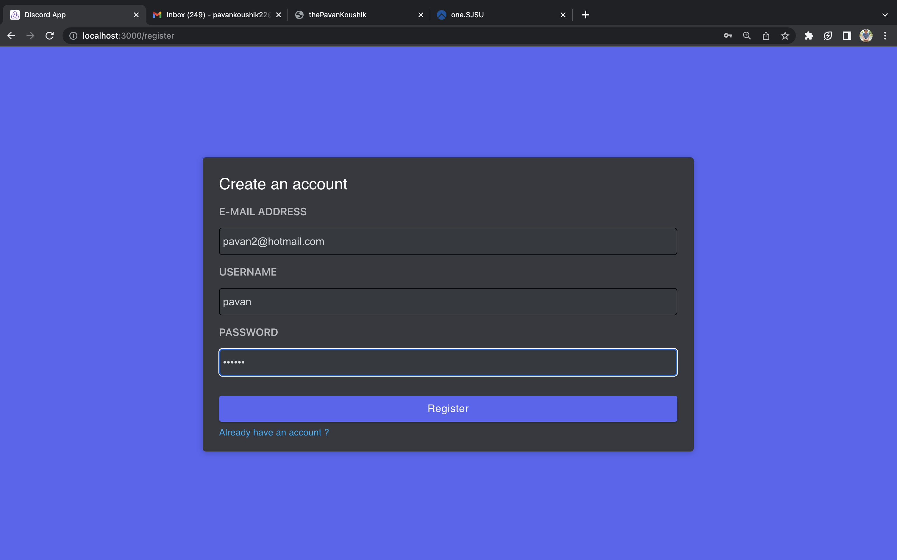
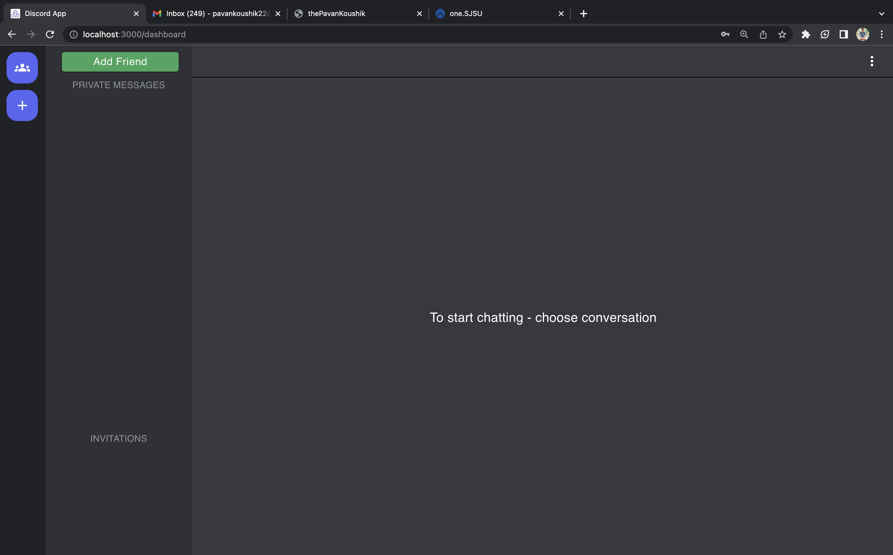
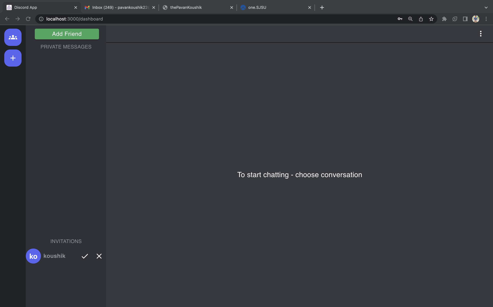
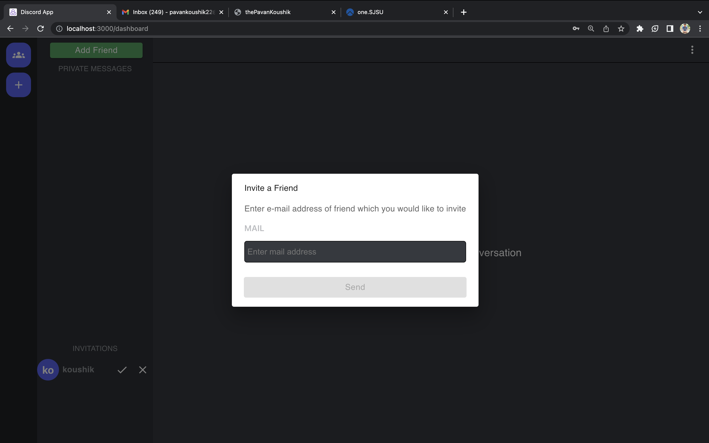
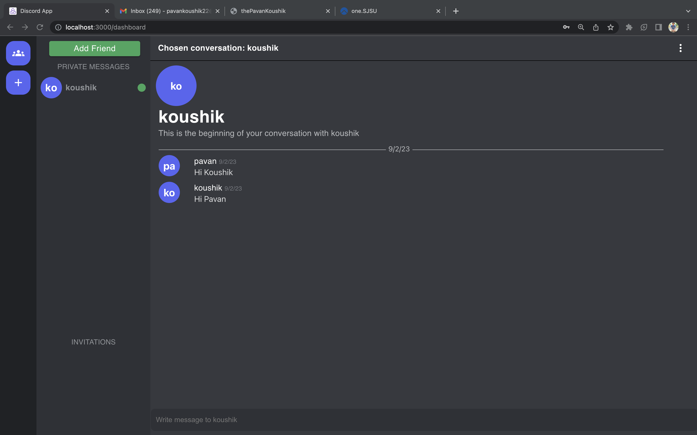
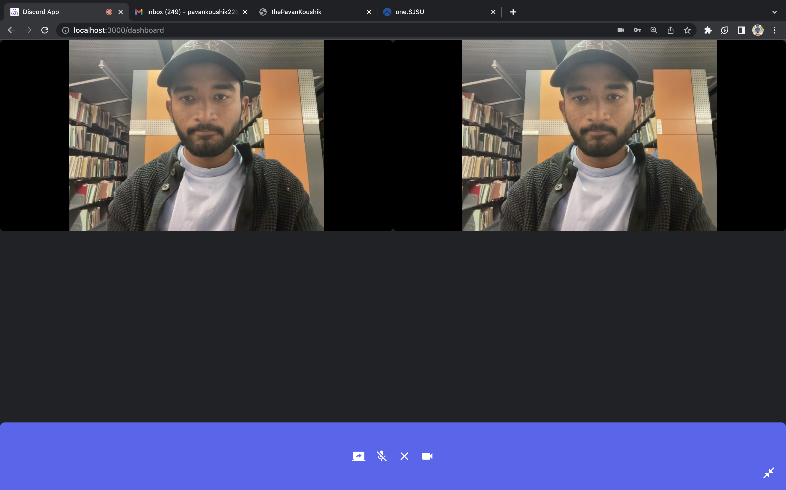
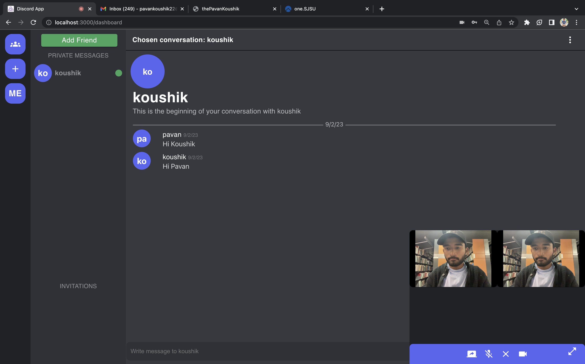
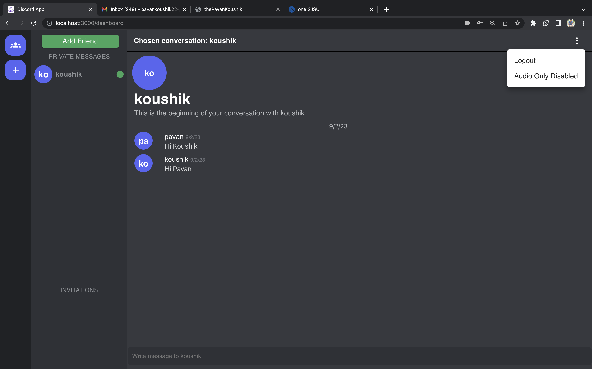

# Discord Clone Application

## System Architecture
 
* Client: React.js, WebRTC
* Backend: Node.js, MongoDB, SocketIO

## Object Management Policy

When a request is made from the client, the request is processed by the API gateway, and the request, along with its parameters like path params, query params and body params are extracted and forwarded to Node JS. Once the request task is accomplished, the response is sent to client. 

####Video Calling Policy:

* On front end, I have used JavaScript to create a WebRTC connection between client and sever. This connection allowed me to send real-time data and media streams between client and server

####Real Time Chat Policy:

* On the backend, I have integrated Socket.IO into server-side code. This would allow me to handle real-time events emitted by the client, and to send real-time updates to the client.

## Contributing 💡

#### Step 1

- **Option 1**

  - 🍴 Fork this repo!

- **Option 2**
  - 👯 Clone this repo to your local machine.

#### Step 2

- **Build your code** 🔨🔨🔨

#### Step 3

- 🔃 Create a new pull request.

## License

- **[MIT license](http://opensource.org/licenses/mit-license.php)**

## Screenshots of the App

